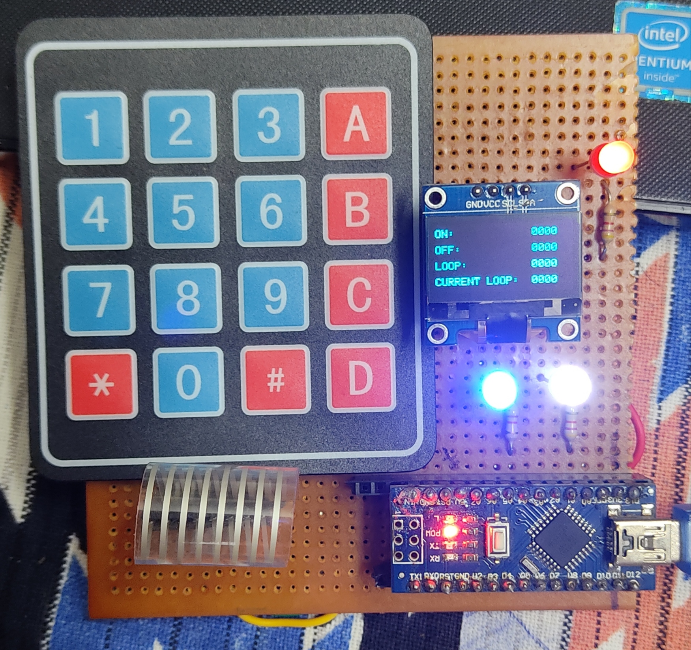
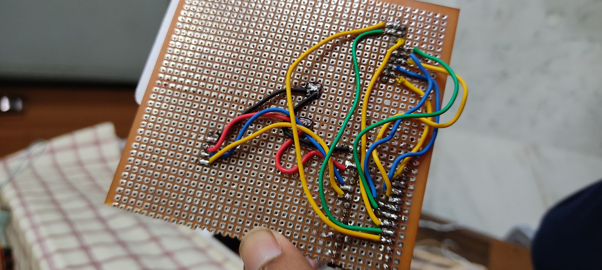

### Keypad OLED Project
Use case :- Keypad will be used to give inputs, OLED will be used to show those inputs. Inputs will be of the ON OFF period of a relay.

 

#### How to Use :-
- A is setting ON time
- B is for setting OFF time
- C is for setting the loop
- D is for done or set the inputs.
- * is for starting the function.
- # if for clear or reset.
- White LED for Relay ON OFF
- Blue LED will blink when there is an input - used for input confirmation.

#### Conditions :- 
- No. of digits should not exceed 4
- Keypads should be firmly pressed or else input is not detected.

#### 1.0.1 (code)
- OLED I2C working
- Keypad is working
- Used Arduino nano
- Three Indication LEDs

#### 1.0.2 (code)
- Added power led code.
- Added basic code for oled to show counts.
- Added code for keypad to give inputs.
- Added code to delete specific area in oled.

#### 1.0.3 (code)
- Added field for different Inputs like ON, OFF, Loop, Current Loop
- Added a switch case structure for different inputs
- Added A for going to next line.
- Added B for showing the input.
- Added C for clear and Reset.

#### 1.0.4 (code)
- Deleted the unused part in the code.
- Added some print commands in the code.
- made a function for displaying data.

#### 1.0.5 (code)
- Added code to truncate digits when its exceeds 4.
- Blue LED will blink during inputs.
- Deleting specific area is working fine.
- Will add * for starting and stopping the function

#### 1.0.6 (code)
- Added * to start the functioning of the system.
- couldnt configure the stopping of the system with * since it was in a while loop.
- need to change the 'line' in displayData func to 'y'. was creating issues in the 2nd line of UI.
- some problem in the 2nd input in UI couldnt resolve.
- added code to return to initial state after completetion.
- need to add some LED indication with blue LED of completition and starting function.

#### 1.0.7 (feature)
- Trying adding image to the github repository.

#### 1.0.8 (code)
- Added code version in the startup text.
- Added condition for the current loop not to show 0000 on completion of working.
- Initial state of Relay Pin and Led pins are low.
- Added part for infinite loop if 0 is pressed as no. of loops.
- if counter is greater than 9999 make it 0.

#### 1.0.9 (code)
- Startup msg will be shown for 2 secs.
- Did few bugfixes.
- Working smoothly.
- Need to work on the input display.

#### 2.0.1 (code)
- Made some new changes in code.
- Changed the button sequence of input.

- Need to add a push button for taking inputs for on off time in seconds or minutes.

